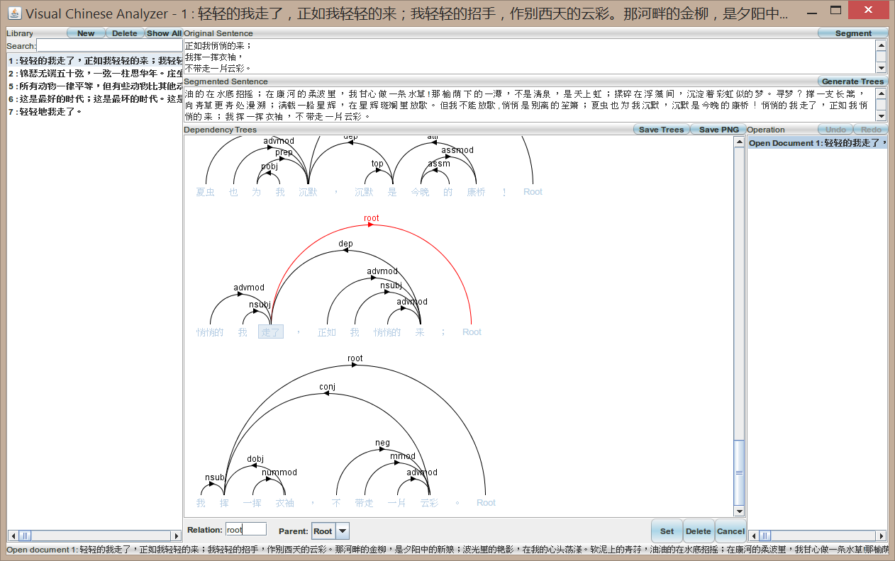

Visual Chinese Analyzer
=======================

A user-friendly visual dependency parser for Chinese sentences  
It is based on the Stanford Parser and also includes a SQLite database to store all dependency trees  
  
- Offline version: In the VisualChineseAnalyzer directory  
    - Usage: Import as an Eclipse project, execute the edu.pku.java.g3l.VisualChineseAnalyzer class  
    - This is one of my first Java programs I wrote many years ago, so I do not use packages to manage its source code

- Also provide an online version:  
  - The visual part is in the front-end part, based on Java Applet  
  - The processing part is in the back-end part, based on Java Servlet  
